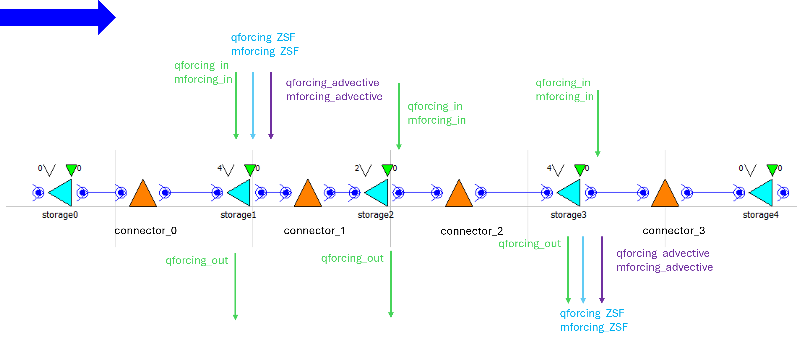
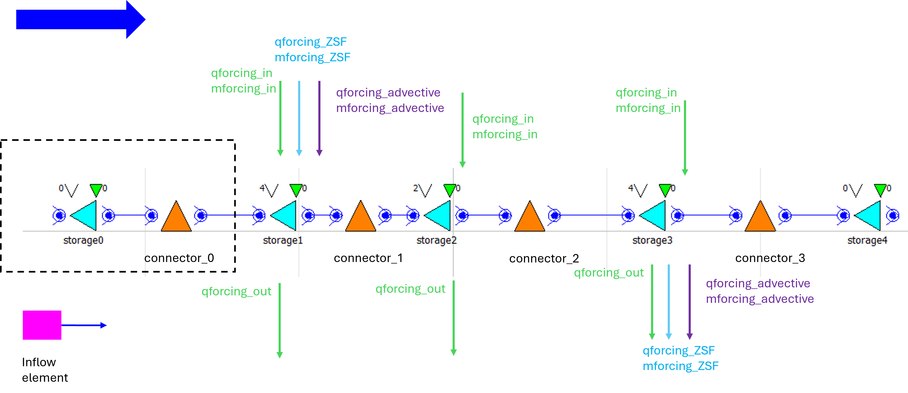

.. _modelling:

Modelling
=========

Input timeseries
----------------

Inflow and outflow can be defined for each storage. For inflow, the discharge must be positive and a flux must be provided; for outflow, the discharge must be negative. These time series are named q_forcing_in, m_forcing_in, and q_forcing_out. All other time series in the file are only placeholders and should not be modified by the user.

In the figure above, the purple and blue arrows are calculated by the model and appear only as placeholders in the timeseries_import file. The advective discharges are computed by the model and should not be set by the user. The upstream advective discharge is a placeholder, while the downstream advective discharge is used to compensate for water-level changes.

Other information
-----------------
The purple lines are the advective discharge and they are needed as they are the closing term of the calculation. If discharge closing is used, in the current state of the model it is assumed that the directions are from left to right. The magnitude of this discharge is positive, here it means positive is leaving the system.

The see and lake water levels shown in the picture are the ones used by ZSF. The water levels are calculated from the given initial volume using a large surfece.

The forcings the positive is into the system, the negative is out. So the user has to set q forcing in positive, q forcing out negative. As for discharge closing the closing post is located downstream, only one directional discharge is allowed. I.e. if you take out water from storage 1, that will not work, only with water level closing.

Model building
--------------

The model can be built from elements as reservoirs and they should be connected with connector elements to calculate the transport. These reservoirs elements can be SaltyLinearReservoir and SaltyLinearReservoirBnd (if it is a boundary), connected with SubstanceControlledStructure. The model expects the following in- and outputs that should be declared in the modelica file:

* input: upstream and downstream discharge, upstream_flux - if the boundaries are not open
* input: _qforcing_in, _qforcing_out and _mforcing_in for every Reservoir structure
* input: _qforcing_ZSF, _mforcing_ZSF for the upstream and downstream Resrvoir structures
* input: _middle_discharge for all SubstanceControlledStructure elements ()
* output: concentration + storage name for every storage (also boundary ones), concentration_storage1 = storage1.HQUp.C
* output: flux for all the connector elements: connector_0_M_Up=connector_0.HQUp.M;

The figure below shows how a model is built with three boxes and upstream (sea) and downstream (lake) open boundaries. These open boundaries mean that there is dispersion between the box and the boundary, and they are modelled using the element SaltyLinearReservoirBnd. Each normal / in between element is modelled with SaltyLinearReservoir. Each element can have in- and outflow (green arrows), and the two boxes in the extremes can have  connectin to ZSF (blue) or extra advective discharge (purple). Note that this is only possible at one end of the system: for example there is extra advection discharge upstream, then the advection discharge downstream is calculated by the model to maintain the water levels (default). It can also be the other way around.

   
